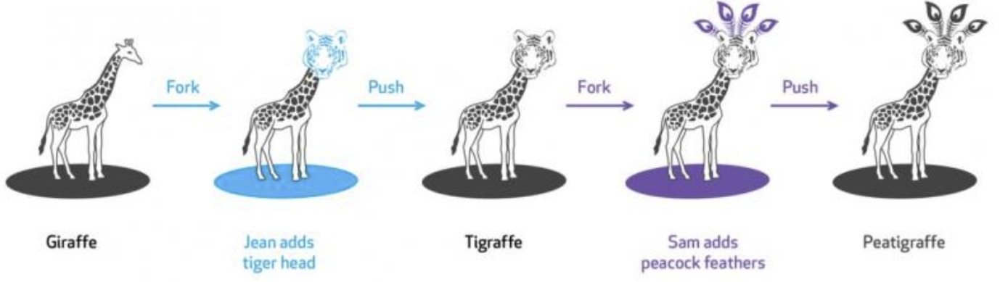

# Version Control System

[查看中文版](/zh/basis/vcs.md)

VCS (version control system) is any kind of practice that tracks and provides control over changes to source code.

If you are using google doc, you will see the "Version History" link.

Click this link, the google doc will redirect you to the edit history of current document.

So all the document save actions are recorded.

Behind the this google doc function, the "Version Control" system was recording every snapshot when the user click save button.

## Version Control System with git

If Tom, Jane and Anna are working on the same project, they need to tell each other what changes each one made.

This is not efficient and if we want to merge all the work from 3 individuals, that is quite hard.

Many years ago, we have a solution, let 3 people login to a server and every time only one person can make the modification.

We resolve the sync-up difficulty, but still this is not efficient. What if 3 people can work at the same time and there is a system to manage different copies, different versions.

Let's see how git resolve these problems.

- Git is an system which management the repository versions from who can access it.
- Once the repo is checked out, the local has a full snapshot of the repository.
- When push the change, merging happens and needs to resolve all the conflicts.



## Use "github"

Now let's create an account in "[Github](https://github.com)",

Follow github's guide to sign up with a user name or email.

Click "+" button to create a new repository. Let's give a name "python_for_kids_homework"

Later on we will share some projects and work together. For the time being, the repository will record the homework version history.

## Install "git"

Let me assume most of readers are studying in Windows 10 OS.

- Go https://git-scm.com/downloads and download the proper executable file based on your OS.
- Double click and install git client. Make sure you select "Git Bash"

## Install "Visual Studio Code"

We will use local editor "Visual Studio Code" as the main code editor.

We also use online environement for quick code explaination.


- Go to https://code.visualstudio.com/
- Download the program which fits your platform
- Install VSCode into the OS
- Open "Visual Studio Code"
- Show the terminal and select "git bash"

In the terminal with "Git Bash", try to clone the repository we just created in github.com.

```shell
cd ~
git clone https://github.com/<your user name>/python_for_kids_homework.git
cd python_for_kids_homework
ls
```

- `cd` is a command which is used to `Change Directory`
- `git clone` is a command which follows the pattern `<main command> <sub command>`
- `ls` is a command to list all the files in current direcotry.

## More git skills

[More Git Knowledge and Practice](/basis/git.md)

[Homework 1](../homework/basis_vcs.md ':include')

## Reference

- https://en.wikipedia.org/wiki/Version_control
- https://en.wikipedia.org/wiki/Comparison_of_version-control_software


## Extend Reading

- [Pro Git](https://git-scm.com/book/en/v2) is **highly recommended reading**. Going through Chapters 1–5 should teach you most of what you need to use Git proficiently, now that you understand the data model. The later chapters have some interesting, advanced material.
- [Git from the Bottom Up](https://jwiegley.github.io/git-from-the-bottom-up/) is a detailed explanation of Git’s implementation details beyond just the data model, for the curious.
- [How to explain git in simple words](https://xosh.org/explain-git-in-simple-words/)
- Youtube: Lecture from Cambridge
  - <iframe width="560" height="315" src="https://www.youtube.com/embed/2sjqTHE0zok" title="YouTube video player" frameborder="0" allow="accelerometer; autoplay; clipboard-write; encrypted-media; gyroscope; picture-in-picture" allowfullscreen></iframe>

