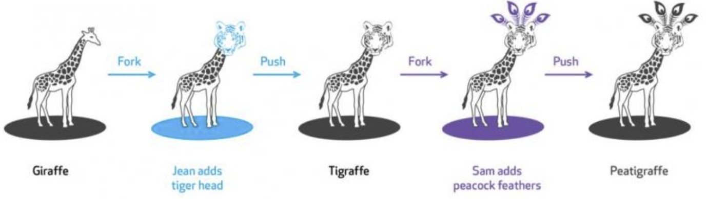

## 版本控制系统

[View English Version](/basis/vcs.md)

VCS（version control system）是任何一种跟踪和提供对源代码变化控制的做法。

如果你在使用google doc，你会看到 "版本历史 "链接。

点击这个链接，google doc会把你重定向到当前文档的编辑历史。

我们可以看到所有的文档保存动作都被记录下来。

在这个google doc功能的背后，"版本控制" 系统记录了用户每次点击保存按钮时的快照。

## 使用git的版本控制系统

让我们来看看这个场景，如果汤姆、简和安娜在同一个项目上工作，他们需要告诉对方每个人做了什么修改，并统一合并到这个项目上来。

这并不高效，如果我们想合并三个人的工作，那是相当困难的。

很多年前，我们有一个解决方案，让3个人登录到一个服务器，每次只有一个人可以进行修改。

我们解决了同步的困难，但这仍然是不搞笑的。如果3个人可以同时工作，并且有一个系统来管理不同的副本，不同的版本，那效率是不是大大提高了？

让我们看看git是如何解决这些问题的。

- Git是一个管理仓库版本的系统，谁都可以访问它。
- 一旦版本库被检出，本地就会有一个完整的版本库的快照。
- 当推送修改时，合并会发生，并需要解决所有的冲突。



## 使用 "github"

现在让我们在 "https://github.com" 创建一个账户。

按照github的指南，填写用户名或电子邮件注册。

注册之后，点击 "+" 按钮，创建一个新的资源库。让我们给这个新的资源库一个名字 "python_for_kids_homework"

以后我们也会分享一些项目并一起协同工作。目前，该版本库将记录家庭作业的历史版本。

## 安装 "git"

让我假设大多数读者是在Windows 10操作系统中学习的。

- 去https://git-scm.com/downloads，根据你的操作系统下载合适的可执行文件。
- 双击并安装git客户端。确保你选择 "Git Bash"。

## 安装 "Visual Studio Code"。

我们将使用本地编辑器 "Visual Studio Code" 作为主要代码编辑器。

我们也使用在线环境来快速解释代码。

- 转到https://code.visualstudio.com/
- 下载适合你的平台的程序
- 在操作系统中安装VSCode
- 打开 "Visual Studio Code"。
- 显示终端并选择 "git bash"。
- 在 "Git Bash "的终端，尝试克隆我们刚刚在github.com上创建的仓库。

```
cd ~
git clone https://github.com/<your user name>/python_for_kids_homework.git
cd python_for_kids_homework
ls
```

- cd是一个用于改变目录的命令。
- git clone是一个遵循<主命令><子命令>模式的命令。
- ls 是一个用来列出当前目录中所有文件的命令。

##　更多git技能

[更多git 扩展和练习](/basis/git.md)


[Homework 1](../homework/basis_vcs.md ':include')


## 扩展阅读

- [Pro Git](https://git-scm.com/book/en/v2) is **highly recommended reading**. Going through Chapters 1–5 should teach you most of what you need to use Git proficiently, now that you understand the data model. The later chapters have some interesting, advanced material.
- [Git from the Bottom Up](https://jwiegley.github.io/git-from-the-bottom-up/) is a detailed explanation of Git’s implementation details beyond just the data model, for the curious.
- [How to explain git in simple words](https://xosh.org/explain-git-in-simple-words/)
- Youtube: Lecture from Cambridge
  - <iframe width="560" height="315" src="https://www.youtube.com/embed/2sjqTHE0zok" title="YouTube video player" frameborder="0" allow="accelerometer; autoplay; clipboard-write; encrypted-media; gyroscope; picture-in-picture" allowfullscreen></iframe>

